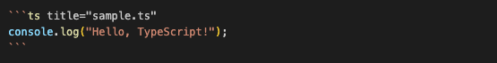

# rehype-momiji (in development)

[rehype](https://github.com/rehypejs/rehype) plugin powered by [shiki](https://shiki.matsu.io/).

## features

- Highlighting Code
- Displaying Filename

## How to use?

When you want only highlighting code block, just use this package. If you want to display a filename, you need to install `remark-momiji`.

