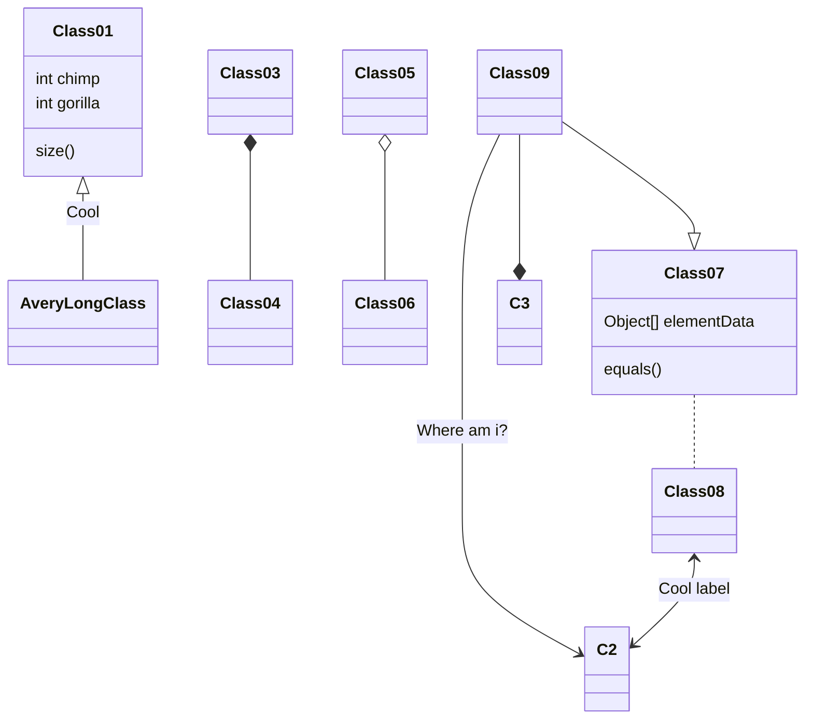

# # Section1

これはMarkdownの試し打ちです。適宜チューニングしていきたい。
以下、怪文書が続きます。

## ## Section 2

**以下は、法学部の生徒が学ぶ代表的な法律の分野です。**

- 刑法
- 民法
  - 民法総則
  - 債権総論
  - etc...
- 憲法

とある法学部の学生が、法律の勉強をしているときに、次のような名言を思い出しました。

> Sweet are the uses of adversity, Which, like the toad, ugly and venomous, Wears yet a precious jewel in his head.
>
> Shakespeare

### ### Section 3

~ねこ~ いぬ（w300 * h200）
  

動物の画像を表示してみました。
- [ ] 犬は可愛い
- [x] 猫は可愛い

- 以下は、TypeScriptのサンプルコードです。

```ts title="sample.ts"
console.log("Hello, TypeScript!");
```

### (自作) rehype-mermaid のサンプル



### (自作) remark-attention-block / rehype-attention-block のサンプル

> [!NOTE]
> ソードアート・オンライン、通称SAOは、Reki Kawaharaによる日本のライトノベルシリーズ。

> [!WARNING]
> このライブラリは、まだ開発中です。予期せぬエラーが発生する可能性があります。

> [!TIP]
> 実は、このサイトの製作者は、タピオカを人生で一度も食べたことがありません。（本当:thumbsup:）
